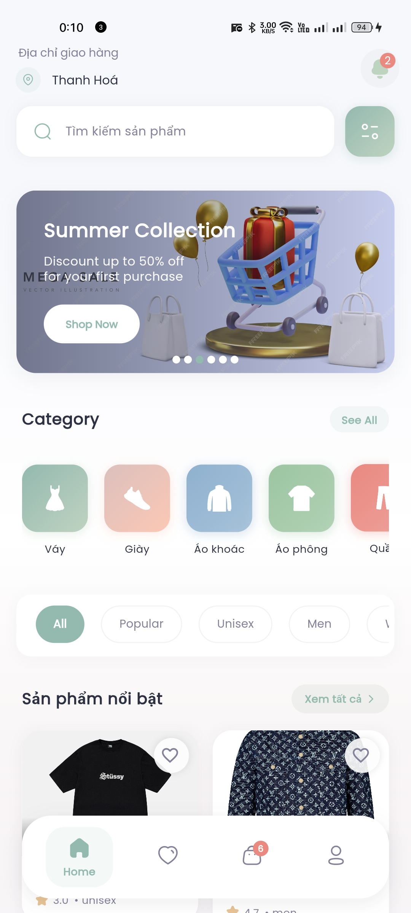
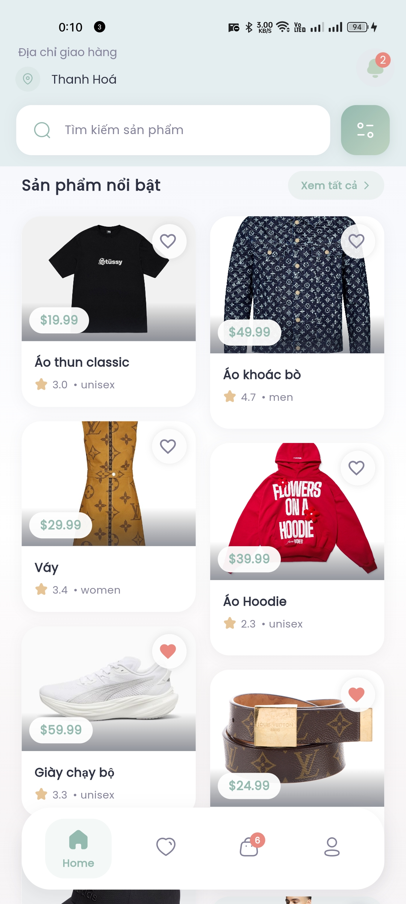
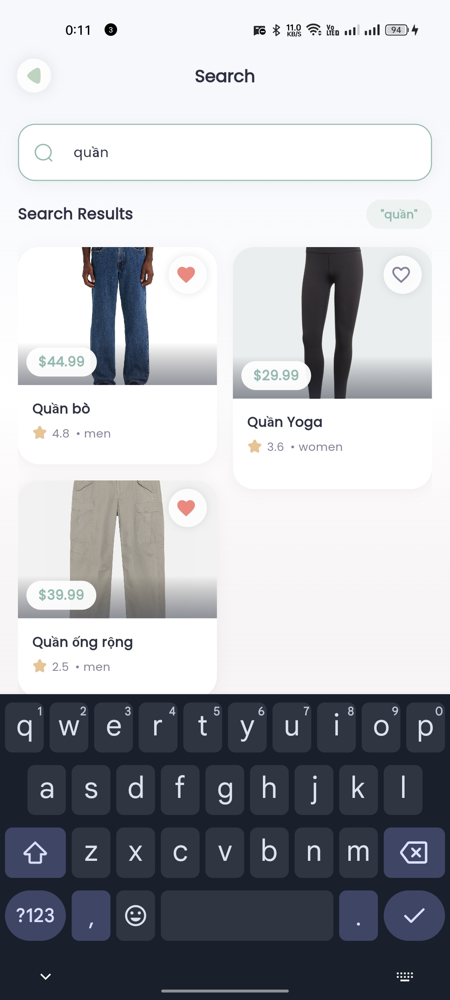
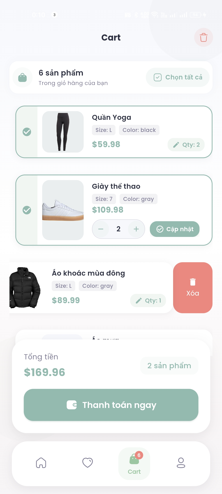
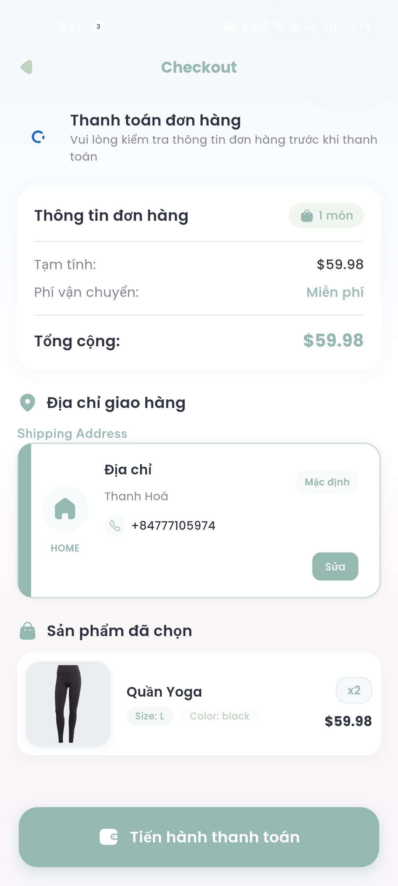
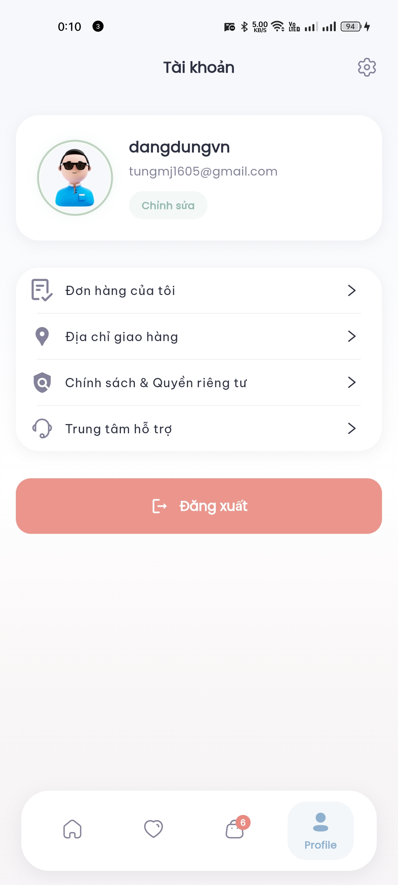
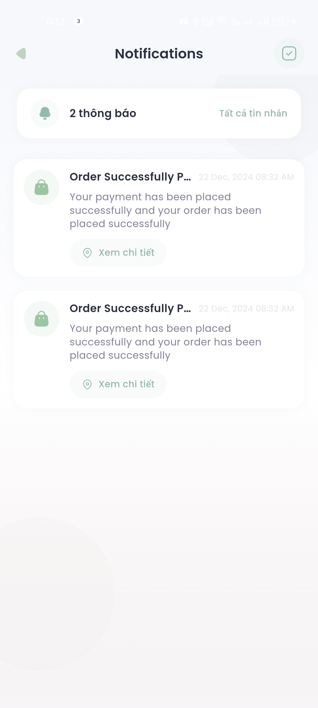
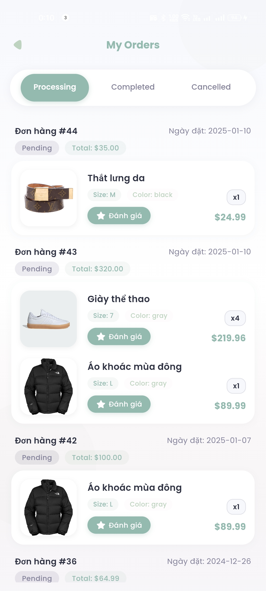
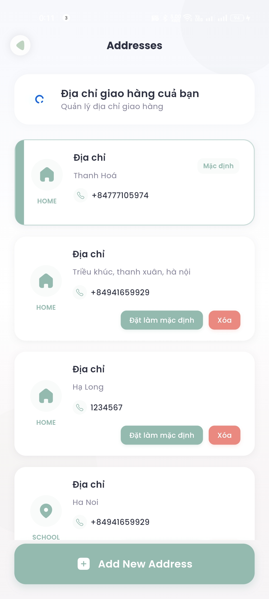
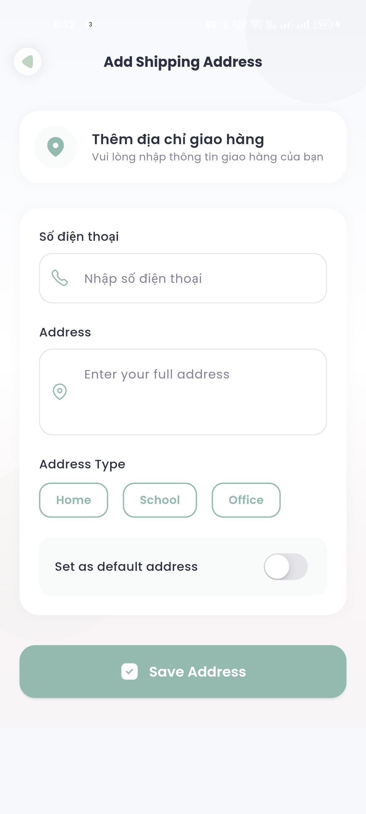

# 👗 Fashion App - Ứng dụng Thời trang Fullstack

<div align="center">
  <p>
    
  </p>
  
  <p>
    <a href="https://flutter.dev" target="_blank"></a>
    <a href="https://dart.dev" target="_blank"></a>
    <a href="https://www.python.org" target="_blank"></a>
    <a href="#giấy-phép"></a>
  </p>
</div>

Dự án ứng dụng thời trang được phát triển bởi **Phan Văn Tùng**, sử dụng Flutter và Python để xây dựng một nền tảng mua sắm thời trang trực tuyến hoàn chỉnh.

## 📋 Mục lục

- [Giới thiệu](#-fashion-app---ứng-dụng-thời-trang-fullstack)
- [Tính năng chính](#-tính-năng-chính)
- [Công nghệ sử dụng](#-công-nghệ-sử-dụng)
- [Cài đặt và Chạy](#-cài-đặt-và-chạy)
- [Cấu trúc dự án](#-cấu-trúc-dự-án)
- [Môi trường](#-môi-trường)
- [Ảnh giới thiệu ứng dụng](#-ảnh-giới-thiệu-ứng-dụng)
- [Đóng góp](#-đóng-góp)
- [Tác giả](#-tác-giả)
- [Liên hệ](#-liên-hệ)
- [Giấy phép](#-giấy-phép)

## 🌟 Tính năng chính

<table>
  <tr>
    <td>
      <ul>
        <li>🛍️ Duyệt và mua sắm sản phẩm thời trang</li>
        <li>👤 Quản lý tài khoản người dùng</li>
        <li>🛒 Giỏ hàng và thanh toán</li>
      </ul>
    </td>
    <td>
      <ul>
        <li>💳 Tích hợp cổng thanh toán</li>
        <li>📱 Giao diện người dùng đẹp và phản hồi nhanh</li>
        <li>🔒 Bảo mật và xác thực người dùng</li>
      </ul>
    </td>
  </tr>
</table>

## 💻 Công nghệ sử dụng

<table>
  <tr>
    <th>Frontend (Mobile & Web)</th>
    <th>Backend</th>
    <th>Thanh toán</th>
  </tr>
  <tr>
    <td>
      <ul>
        <li>Flutter SDK</li>
        <li>Dart</li>
        <li>State Management</li>
        <li>Cross-platform (iOS, Android, Web)</li>
      </ul>
    </td>
    <td>
      <ul>
        <li>Python</li>
        <li>FastAPI/Django</li>
        <li>RESTful API</li>
        <li>SQL Database</li>
        <li>Auth & Security</li>
      </ul>
    </td>
    <td>
      <ul>
        <li>Payment Gateway Integration</li>
        <li>Secure Transactions</li>
        <li>Order Management</li>
      </ul>
    </td>
  </tr>
</table>

## 🚀 Cài đặt và Chạy

### Yêu cầu

- Flutter SDK
- Python 3.8+
- Pip package manager
- Virtual environment

### Frontend (Flutter)

```bash
# Di chuyển vào thư mục fashionapp
cd fashionapp

# Cài đặt dependencies
flutter pub get

# Chạy ứng dụng
flutter run
```

### Backend (Python)

```bash
# Di chuyển vào thư mục backend
cd pybackend

# Tạo và kích hoạt môi trường ảo
python -m venv venv
source venv/bin/activate  # Linux/Mac
venv\Scripts\activate     # Windows

# Cài đặt dependencies
pip install -r requirements.txt

# Chạy server
cd fashion_backend
python manage.py runserver
```

## 📂 Cấu trúc dự án

```
fullstack-fashionapp/
├── fashionapp/           # Flutter application
│   ├── lib/             # Dart source code
│   ├── assets/          # Images, fonts, etc.
│   └── pubspec.yaml     # Flutter dependencies
│
├── pybackend/           # Python backend
│   ├── fashion_backend/ # Backend source code
│   └── requirements.txt # Python dependencies
│
└── fashion_payment/     # Payment integration module
```

## 🔧 Môi trường

Dự án sử dụng các file môi trường khác nhau cho development và production:

- `.env.development`: Cấu hình cho môi trường phát triển
- `.env.production`: Cấu hình cho môi trường production

## 📱 Ảnh giới thiệu ứng dụng

### 🏠 Màn hình chính & Tìm kiếm

<div align="center">
  
  
  
</div>

### 🛒 Giỏ hàng & Thanh toán

<div align="center">
  
  
   
</div>

### 📋 Danh mục & Thông báo & Đơn hàng

<div align="center">
  
  
  
</div>

### 📍 Địa chỉ

<div align="center">
  
  
</div>

## 🤝 Đóng góp

Mọi đóng góp cho dự án đều được hoan nghênh. Vui lòng tạo pull request hoặc báo cáo issues nếu bạn phát hiện bất kỳ vấn đề nào.

## 👨‍💻 Tác giả

- **Họ và tên**: Phan Văn Tùng
- **Email**: tungmj1605@gmail.com
- **GitHub**: [dangdungvn](https://github.com/dangdungvn)

## 📧 Liên hệ

Nếu bạn có bất kỳ câu hỏi hoặc góp ý nào, vui lòng liên hệ:

- Email: tungmj1605@gmail.com
- GitHub: [dangdungvn](https://github.com/dangdungvn)

## 📄 Giấy phép

Copyright © 2024 Phan Văn Tùng. All rights reserved.
